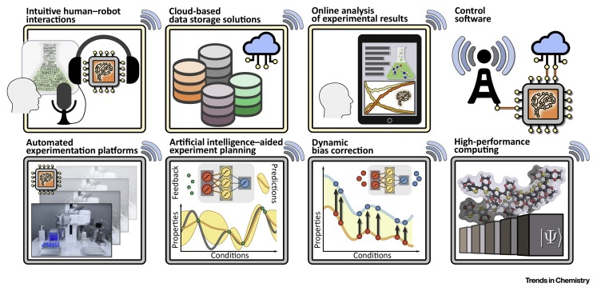

# CMSC 35360-1: Autonomous Laboratories

This graduate-level course focuses on the principles and applications of self-driving, or autonomous, scientific laboratories, combining cutting-edge technology with the potential for significant advancements in scientific research. By the end of the class, you should: understand the concepts and history of autonomous laboratories; be able to apply AI and ML techniques in laboratory settings; and design and optimize experiments in autonomous laboratories.

### Class information

The class meets in CSIL 5 on Tuesday and Thursdays, 3:30pm-4:50pm.

Your instructors are Ian Foster (foster@uchicago.edu) and Rick Stevens (rstevens@uchicago.edu). 

The class Slack channel is #auto-labs-2023 on the UChicago CS Slack. We strongly encourage use of Slack to ask questions and share information.

We use [https://github.com/ianfoster/uc-sdl-2023](https://github.com/ianfoster/uc-sdl-2023) to share information about the class.

### See also:

* [Class syllabus, lectures, etc.](classes/README.md)
* [Assignments](assignments/README.md)
