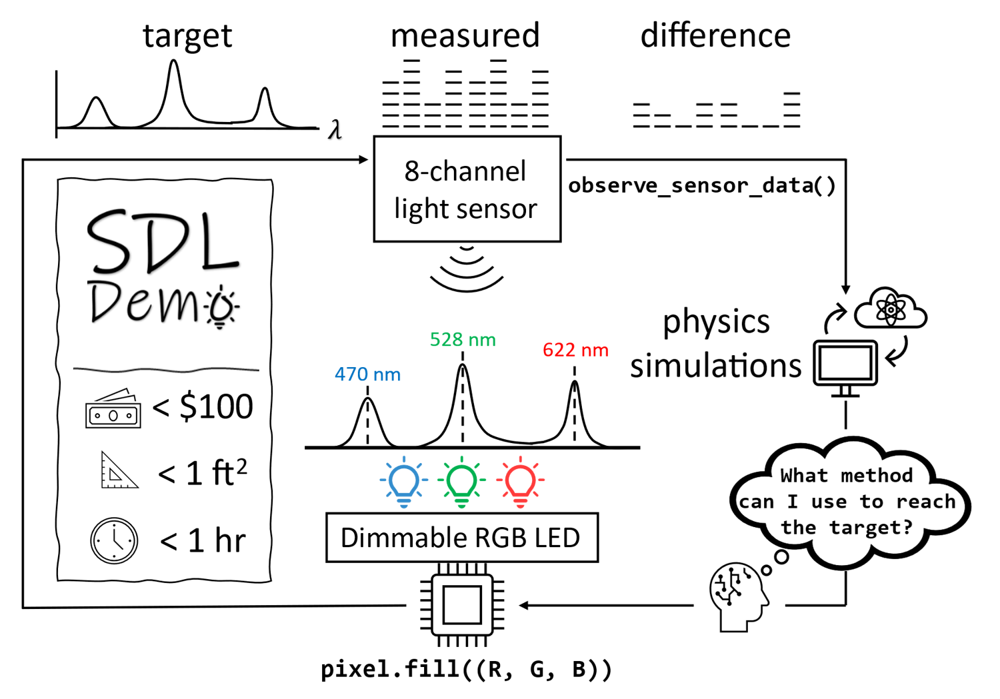

### Light-mixing SDL-Demo, v1: Remote

[Sterling Baird](https://github.com/sgbaird)'s [light-mixing SDL-Demo](https://github.com/sparks-baird/self-driving-lab-demo)
is a self-driving lab demonstration that showcases the capabilities of autonomous laboratories 
in the context of a simple experiment involving light mixing. 
The demo uses an Arduino-controlled LED light setup and a Raspberry Pi to control the experiment.

The experiment involves mixing different colors of light using the LED setup, and measuring the 
resulting color using a color sensor. 
The self-driving lab aspect of the demo comes into play when the system autonomously adjusts the 
color mixing to achieve a desired color output based on feedback from the color sensor: 
see the following figure from [light-mixing SDL-Demo](https://github.com/sparks-baird/self-driving-lab-demo):

In this first assignment, you will run experiments on the color-mixing SDL-Demo hardware located at the University of Utah.
[This Jupyter notebook](https://github.com/sparks-baird/self-driving-lab-demo/blob/main/notebooks/4.2-paho-mqtt-colab-sdl-demo-test.ipynb) shows how this is done, and also provides implementations of grid search, random search, and Bayesian optimization for a color mixing task.

### Your task

* Run this experiment 10 times and report on what you learn. 
    How much does the performance of the the different methods vary according to target color and random seed?
